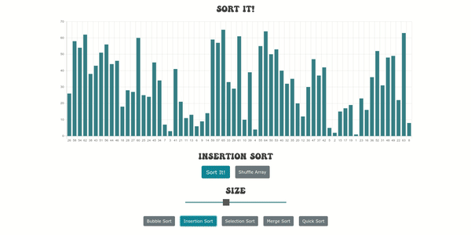

# Sort-it

> A fun, interactive visual representation of popular sorting algorithms.


Check out the app [HERE](https://suspicious-bassi-689da4.netlify.app/)!

#

<div align="center">
  
</div>

#

### Summary
I built this application for a few reasons. First, I really wanted to dive into 
learning typescript. Ever since I started C# development I have found the 
power of using a strongly typed language and I have felt that I was missing
that functionality within my react development. Typescript to the rescue!
I found the process very enjoyable and hope to continue to learn more about it's 
functionality. I also had an opportunity to learn the sorting algorithms 
that are showcased in the project. It was really fun to dive into the problems,
especially the tougher ones! There was a added level of complexity within the algorithms
which was pausing execution for viualization and coloring. I am hoping this can be 
the perfect stepping stone to having a deeper understanding of data structures 
and algorithms.
    
Specific things I used and learned while building this application:

> Typescript Syntax

> Quick Sort

> Merge Sort

> Insertion Sort

> Selection Sort

> Bubble Sort

> Pausing execution with asynchronous functions

### Installation

In a terminal run the following commands

```
git clone https://github.com/bbastanza/Sort-It.git
cd Sort-It
npm i
npm start
```

### Author

#### Brian Bastanza- Full Stack Web Developer

<a href="https://www.brianbastanza.me/" target="_blank" rel="noopener">Personal Website</a>

[LinkedIn](https://www.linkedin.com/in/bbastanza)
